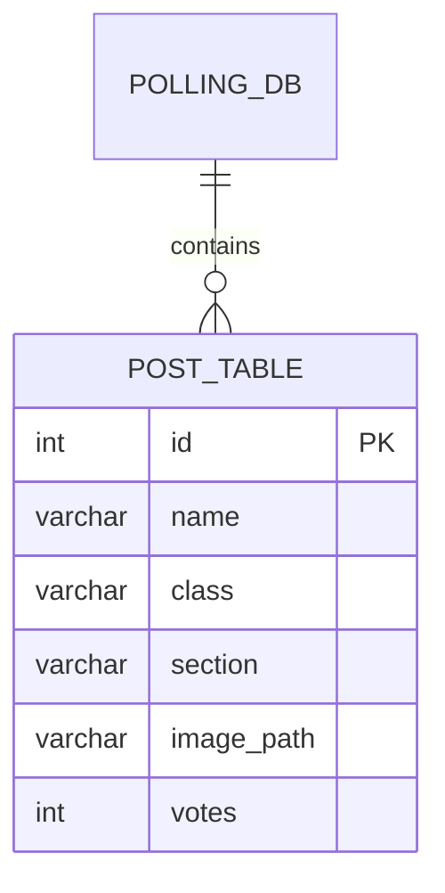

# Polling Application

> A database-driven desktop software implemented using Python and `tkinter`. It executes raw SQL queries against a backend MySQL server via the `mysql.connector` library to manage and process election data states. The program uses index-based pointers to traverse predefined posts and dynamically generate the GUI.

> [!CAUTION]
> ## Deprecation Warning
> This version of my election software is outdated, and may not function as intended.<br><br>Check out the latest version at [Naresh-x86/Stable-Polling-V2](https://github.com/Naresh-x86/Stable-Polling-V2), featuring new, improvised management features and full-fledged interfaces for all aspects of the software!
---

### Database Integration & Schema

The state of the application is deeply coupled with the MySQL configuration defined in `config.json`.



<br/>

*   **Connection Protocol**
    <br/>
    The script connects via standard TCP socket using `host`, `user`, `password`, and `database` keys parsed from the JSON configuration payload.
    <br/>

*   **Relational Mapping**
    <br/>
    The `posts` array in `config.json` directly maps to table names in the MySQL database (e.g., `['president', 'vice_president']`).
    <br/>

*   **DML Operations**
    <br/>
    When a vote is cast via the `vote(candidate_id)` function, a parameterized `UPDATE` query increments the integer value in the `votes` column corresponding to the specific primary key `id`. A subsequent `SELECT` query retrieves the associated `name` string to populate the confirmation modal.
    <br/>

### User Interface Implementation

*   **Dynamic Generation**
    <br/>
    The main loop iterates over the `posts` array. For each index, it retrieves the total `number_of_candidates` via a `fetchall()` fetch routine. It then computes coordinate spaces to dynamically place image objects (loaded via PIL) and button widgets horizontally across the screen.
    <br/>

*   **Modals and Event Loops**
    <br/>
    The application leverages `Toplevel` widgets to spawn borderless notification windows indicating successful transaction commits. It utilizes the `root.after()` method to schedule the destruction of the modal and the generation of the subsequent post's candidate list after a specific millisecond delay, bypassing thread-blocking operations.
    <br/>

*   **Character Replacement Routine**
    <br/>
    The string manipulation function `replace_characters()` cleans arbitrary underscores and handles formatting before rendering candidate names to the `tkinter` Canvas elements.
    <br/>

---

### Setup & Run Instructions

> [!CAUTION]
> A running instance of MySQL Server (8.0+) is strictly required before starting the application.

1. **Clone & Install Dependencies**
   Initialize your environment and install the required packages:

   ```bash
   pip install mysql-connector-python Pillow
   ```

2. **Database Configuration**
   Import the provided `sample_db.sql` into your local MySQL server to establish the necessary tables and mock data.

   ```bash
   mysql -u root -p < sample_db.sql
   ```

   Ensure your `config.json` file is correctly formatted with your local credentials:

   ```json
   {
     "host": "localhost",
     "user": "root",
     "password": "yourpassword",
     "database": "polling_db",
     "posts": ["president", "vice_president"]
   }
   ```

3. **Launch the Application**
   Run the main application script:

   ```bash
   python Application.py
   ```

---

### Execution and File Structure

| Script Name | Purpose | Operational Scope |
| :--- | :--- | :--- |
| `Application.py` | **Voter Terminal** | Primary runtime executable. Handles DML `UPDATE` statements for incrementing votes. |
| `DatabaseSelector.py` | **Routing** | Auxiliary script to change active target databases. |
| `TableEditor.py` | **Administration** | Administrative script designed to perform `INSERT`, `UPDATE`, and `DELETE` routines on candidate records. |
| `Results.py` | **Analytics** | Issues `SELECT` queries with `ORDER BY votes DESC` clauses to render final tallies. |

<br/>

> [!TIP]
> The `sample_db.sql` database dump file is provided and required for structural initialization of the relational tables prior to executing `Application.py`.

---

> [!NOTE]
> No Artificial Intelligence or automated code generation tools were utilized in the programming of this project. The entire codebase, including logic, UI design, and database structures, was written manually by hand.
